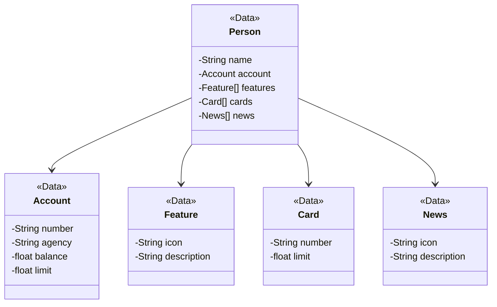

### Project for the dev week

#### Class Diagram

```mermaid
classDiagram
    class Person {
        <<Data>>
        -String name
        -Account account
        -Feature[] features
        -Card[] cards
        -News[] news
    }
    class Account {
        <<Data>>
        -String number
        -String agency
        -float balance
        -float limit
    }
    class Feature {
        <<Data>>
        -String icon
        -String description
    }
    class Card {
        <<Data>>
        -String number
        -float limit
    }
    class News {
        <<Data>>
        -String icon
        -String description
    }

    Person --> Account
    Person --> Feature
    Person --> Card
    Person --> News
```
